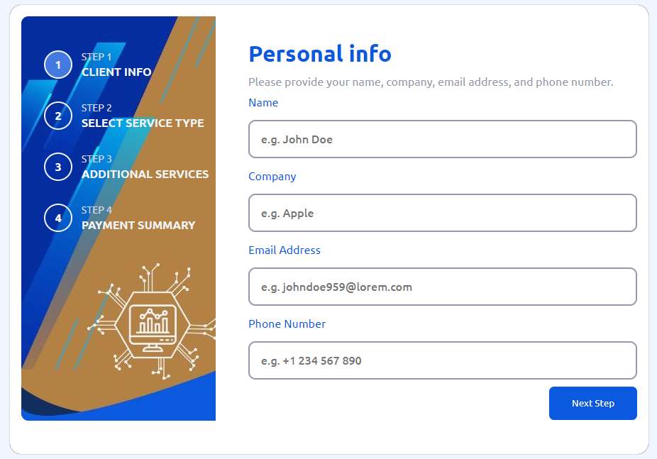

# Business Service Plan

## Description

The Business Service Plan is a responsive multi-step form project that helps businesses or clients subscribe for services effectively. Users can navigate through various steps to provide information required for their business service plans. The application is built to deliver a smooth user experience with form validation and dynamic step navigation.

## Live Demo

Check out the live demo of the project [here](https://business-serive-plan.vercel.app/).




## Table of Contents

- [Features](#features)
- [Technologies Used](#technologies-used)
- [Getting Started](#getting-started)
- [Installation](#installation)
- [Usage](#usage)
- [Contributing](#contributing)
- [Acknowledgements](#acknowledgements)

## Features

- Multi-step form for business service planning.
- Real-time form validation for user inputs.
- Smooth navigation between steps.
- Responsive design, compatible with various devices.
- Clear call-to-action for each step.

## Technologies Used

- HTML5
- CSS3
- JavaScript (ES6)
- [Frontend Mentor Challenge](https://www.frontendmentor.io/)
- Vercel for deployment

## Getting Started

To get a local copy of the project up and running on your machine, follow these steps.

### Prerequisites

Ensure you have the following installed on your machine:

- Node.js
- Git

### Installation

1. **Clone the repository**

   ```bash
   git clone https://github.com/yourusername/business-service-plan.git
   ```

2. **Navigate to the project directory**

   ```bash
   cd business-service-plan
   ```

3. **Install dependencies**

   If your project uses any dependencies, install them using:

   ```bash
   npm install
   ```

### Usage

1. **Run the project locally**

   If using a local server:

   ```bash
   npm start
   ```

2. **Open your browser**

   Visit `http://localhost:3000` to see the application in action.

## Contributing

Contributions are welcome! Please fork this repository and submit a pull request for any improvements, bug fixes, or new features. Ensure your code follows the established style guide and conventions.

1. Fork the Project
2. Create your Feature Branch (`git checkout -b feature/AmazingFeature`)
3. Commit your Changes (`git commit -m 'Add some AmazingFeature'`)
4. Push to the Branch (`git push origin feature/AmazingFeature`)
5. Open a Pull Request

## Acknowledgements

- Challenge by [Frontend Mentor](https://www.frontendmentor.io?ref=challenge).
- Coded by [Davedigital](#).
- Special thanks to all contributors and supporters.